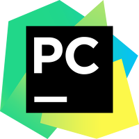

### Hi everyone 👋 
My name is Evgeny Shandrik. I'm Automation QA.
 

## 💡Technologies and tools 

    
    

 
                                                  
## 🚀 Statistics 

 

 
 
                                                  
## 📱 Contacts

